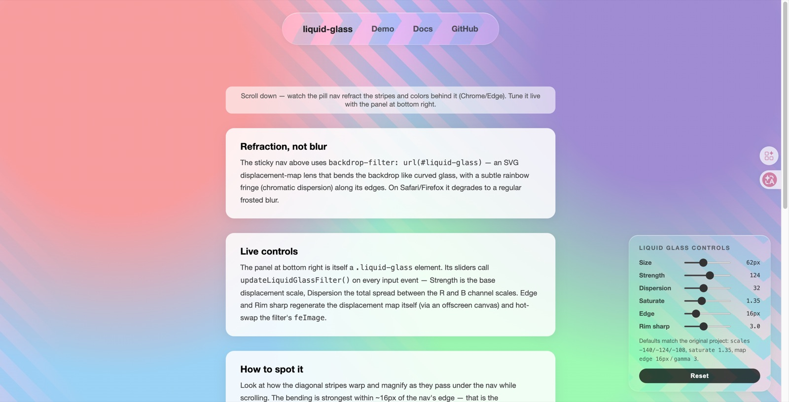
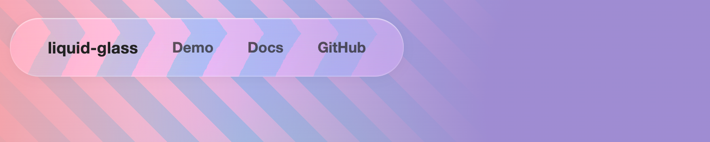

# liquid-glass

**Apple-style liquid glass for the web — a real refraction lens for `backdrop-filter`, not another frosted blur.**




*The demo page: a sticky glass capsule nav refracting the backdrop, tuned live by the control panel (itself a `.liquid-glass` element).*

## Features

- 🔍 **True refraction, not blur** — an SVG displacement-map lens bends the backdrop like curved glass; the content behind stays sharp
- 🌈 **Chromatic dispersion** — per-channel scale offsets produce a subtle rainbow fringe, like light through a prism
- 📐 **Equal-width edge refraction band** — the lens profile concentrates bending along the rim, simulating a rounded glass edge
- 📦 **Zero dependencies, no build step** — pure ESM JavaScript; copy two files and go
- ⚛️ **Vanilla core + React wrapper** — use `injectLiquidGlassFilter()` anywhere, or `<LiquidGlass>` in React
- 🎛️ **Live-tunable API** — `updateLiquidGlassFilter()` patches scales/saturation in place for sliders and settings panels
- 🍂 **Graceful degradation** — automatic frosted-glass fallback on Safari/Firefox via `@supports`

## Quick start

```js
import { injectLiquidGlassFilter } from 'liquid-glass';
import 'liquid-glass/css'; // or a plain <link rel="stylesheet">

injectLiquidGlassFilter(); // call once on app start
```

```html
<nav class="liquid-glass">Home · Docs · GitHub</nav>
```

Done — the nav is now a liquid glass lens (in Chromium; frosted glass elsewhere).

## How it works

1. `backdrop-filter: url("#liquid-glass")` lets an SVG filter process the element's **backdrop** (whatever is painted behind it).
2. The core primitive is `feDisplacementMap`. The displacement map's **R channel controls horizontal** displacement, **B channel controls vertical**:

   ```
   displacement = scale × (channelValue / 255 − 0.5)
   ```

   so `128` = no displacement, values below 128 push one way, above 128 the other.
3. The map is a **separable lens profile** (256×64 RGBA): R varies only with x, B varies only with y, G = 128 (unused), A = 255. Each axis profile:

   ```
   value
    251 |                                   ______
        |                              ____/
        |                           __/
    128 | -------------------------·-------------------------   center: no displacement
        |                    __/
        |               ____/
      5 | _____________/
        +------------------------------------------------ position
          ^edge^  steep climb (~16px)   ^edge^
   ```

   A flat extreme cap at the very edge, a steep climb over ~16px, then an almost linear ramp through 128 at the center. Combined with a **negative scale** (−140) this produces a magnifying lens whose refraction is concentrated in an equal-width band along the edges — the "curved glass rim" bending light:

   

   *Edge refraction band + chromatic fringe: the diagonal stripes warp and magnify as they pass under the glass, hardest within ~16px of the rim.*
4. **Chromatic dispersion**: the same map is applied 3 times with slightly different scales (`-140 / -124 / -108`). Each result is reduced to a single RGB channel via `feColorMatrix`, then the three are recombined with `feBlend mode="screen"`. The slight displacement difference between channels is the rainbow fringe.
5. The filter region is deliberately oversized — `x="-20%" y="-80%" width="140%" height="260%"` — so edge refraction can spill outside the element's box.
6. **Graceful degradation**: browsers without `backdrop-filter: url()` support (Safari, Firefox) fall back to `blur(12px) saturate(1.5)` frosted glass via an `@supports` query. Chromium gets the pure refraction lens — no blur at all.
7. On the CSS side, inset white highlights fake reflections on the curved edge, and a soft outer shadow makes the element float.

## Install

```bash
npm install github:ccl125/liquid-glass
```

> The package name `liquid-glass` may be taken on the npm registry — if you publish, you may need to rename it in `package.json`.

Or just copy two files into your project — there are no dependencies:

- `src/core.js` (+ `src/map.js`, which it imports)
- `src/liquid-glass.css`

## Usage

### Vanilla

```js
import { injectLiquidGlassFilter } from 'liquid-glass';
import 'liquid-glass/css'; // or a plain <link rel="stylesheet">

injectLiquidGlassFilter(); // call once, e.g. on app start
```

```html
<nav class="liquid-glass">…</nav>
```

Add your own `border-radius`, padding, layout — the class only handles the glass.

### React

```jsx
import { LiquidGlass } from 'liquid-glass/react';
import 'liquid-glass/css';

function Nav() {
  return (
    <LiquidGlass className="my-nav" style={{ borderRadius: 9999 }}>
      Home · Docs · GitHub
    </LiquidGlass>
  );
}
```

Props: `children`, `className`, `style`, `filterId`, `scales`, `saturate`. The filter is injected on mount (idempotent, so multiple `<LiquidGlass>` instances are fine).

## API Reference

### `injectLiquidGlassFilter(options?) => cleanup`

Injects the hidden SVG filter into `document.body`. Idempotent per id — calling it again (or mounting another `<LiquidGlass>`) is a no-op. Safe to import in SSR/Node: no DOM access until called.

| parameter | type | default | description |
| --- | --- | --- | --- |
| `options.id` | `string` | `'liquid-glass'` | Filter id. Must match the `url("#…")` in your CSS. |
| `options.scales` | `[number, number, number]` | `[-140, -124, -108]` | Displacement scales for the R/G/B passes. Larger absolute values = stronger refraction; the spread between them = dispersion (rainbow) strength. |
| `options.saturate` | `number` | `1.35` | Final saturation boost, baked into the filter as a trailing `feColorMatrix`. |
| returns | `() => void` | — | Cleanup that removes the injected SVG. No-op if the filter already existed. |

### `updateLiquidGlassFilter(options?) => boolean`

Patches an **already-injected** filter in place — only the options you pass are touched. Built for live controls (see `demo/panel.js`).

| parameter | type | default | description |
| --- | --- | --- | --- |
| `options.id` | `string` | `'liquid-glass'` | Filter id to look up. |
| `options.scales` | `[number, number, number]` | *(unchanged)* | New R/G/B scales, applied to the three `feDisplacementMap` primitives in order. |
| `options.saturate` | `number` | *(unchanged)* | New value for the trailing `feColorMatrix[type="saturate"]`. |
| returns | `boolean` | — | `false` if no filter with that id exists, `true` on success. |

```js
slider.addEventListener('input', (e) => {
  const s = Number(e.target.value); // base strength
  updateLiquidGlassFilter({ scales: [-(s + 16), -s, -(s - 16)] });
});
```

### CSS: `.liquid-glass`

The class is intentionally minimal — no `border-radius`, no layout rules — so you can restyle freely:

| property | default | notes |
| --- | --- | --- |
| `background` | `rgba(255,255,255,0.15)` | Translucent white tint. Override to taste (e.g. `rgba(0,0,0,0.2)` on dark themes) — must stay translucent or the backdrop won't show. |
| `box-shadow` | inset white highlights + soft outer shadow | Inset highlights fake edge reflections; the drop shadow gives a floating feel. |
| `backdrop-filter` | `blur(12px) saturate(1.5)` fallback, upgraded to `url("#liquid-glass")` via `@supports` | Override only if you know what you're doing. |

## Customization

### Regenerating the displacement map

`src/map.js` ships a ready-made map as a data URI. To generate your own (dependency-free Node script, hand-rolled PNG encoder):

```bash
node scripts/generate-map.mjs my-map.png                      # write a PNG
node scripts/generate-map.mjs --stdout                        # print a data URI
node scripts/generate-map.mjs m.png --edge 24 --gamma 4 --mid 0.5
```

Options: `--width` (256), `--height` (64), `--edge` edge climb width in px (16), `--min`/`--max` edge extremes (5/251), `--gamma` climb steepness (3), `--mid` middle ramp slope (0.62).

## Demo

```bash
cd liquid-glass
python3 -m http.server     # then open http://localhost:8000/demo/
# or: npx serve .          # then open /demo/
```

Opening `demo/index.html` directly via `file://` won't work — browsers block ES module imports over `file://` (CORS). Open it in Chrome/Edge for the full effect.

The demo's control panel tunes everything live: nav size, refraction strength, dispersion, saturation — and even reshapes the displacement map itself (Edge width / Rim sharpness — it regenerates the map on an offscreen canvas and hot-swaps the filter's `feImage`). For offline customization, generate a map with `scripts/generate-map.mjs` and replace the data URI in `src/map.js`.

## Browser support

| Browser | Support |
| --- | --- |
| Chrome / Edge | ✅ Full effect (refraction + dispersion) |
| Firefox | ⚠️ Frosted-glass fallback (`blur`) |
| Safari | ⚠️ Frosted-glass fallback (`-webkit-backdrop-filter: blur`) |

## Known caveats

- `backdrop-filter: url()` only works in Chromium — the fallback is intentional and automatic.
- The oversized filter region means edge refraction can visibly spill outside the element against very empty/uniform backgrounds.
- The effect is GPU-intensive on large elements; prefer it for navs, pills, cards — not full-screen overlays.

---

## 中文说明

**liquid-glass** 是一个"液态玻璃"效果库：不是常见的模糊磨砂，而是用 SVG 位移贴图滤镜（`feDisplacementMap`）让元素背后的内容发生真实折射，像弧形玻璃透镜一样弯折光线，边缘形成等宽折射带，并带彩虹色散。零依赖、纯 ESM、无构建步骤，包含框架无关核心（`injectLiquidGlassFilter`）和 React 包装（`<LiquidGlass>`），另有 `updateLiquidGlassFilter` 可在运行时实时调参。

**原理要点**

- `backdrop-filter: url("#liquid-glass")` 让 SVG 滤镜处理元素背景（backdrop）。
- 位移贴图（256×64）的 R 通道控制水平位移、B 通道控制垂直位移，公式 `d = scale × (value/255 − 0.5)`，128 = 不位移。
- 贴图剖面：中心平台（不位移）+ 边缘约 16px 内急剧爬升 = 等宽边缘折射带，模拟弧形玻璃边缘的弯光；负 scale（-140）产生放大透镜效果。
- 同一张贴图以 -140/-124/-108 三个 scale 各位移一次，按 RGB 单通道拆开再 screen 混合，形成色散（彩虹边缘）。
- 不支持 `backdrop-filter: url()` 的浏览器（Safari、Firefox）通过 `@supports` 自动降级为 `blur(12px) saturate(1.5)` 磨砂玻璃。

**快速上手**

```js
import { injectLiquidGlassFilter } from 'liquid-glass';
import 'liquid-glass/css';
injectLiquidGlassFilter();
```

```html
<nav class="liquid-glass">…</nav>
```

React：`import { LiquidGlass } from 'liquid-glass/react'`，用 `<LiquidGlass>` 包裹内容即可。

**API**：`injectLiquidGlassFilter({ id, scales, saturate })` 注入滤镜（幂等，返回 cleanup）；`updateLiquidGlassFilter({ id, scales, saturate })` 就地更新已注入的滤镜（滤镜不存在返回 `false`），适合滑杆实时调参。CSS 侧 `.liquid-glass` 只提供半透明底色、inset 高光和外阴影，圆角布局等由使用者自行覆盖。

**自定义**：`scales`（折射强度/色散差）、`saturate`（饱和度提升）、`id`（滤镜 id）；可用 `node scripts/generate-map.mjs out.png` 重新生成贴图（`--edge` 控制边缘折射带宽度、`--gamma` 控制陡峭度），demo 面板里也能实时调整这两项。

**浏览器支持**：Chrome/Edge 全效果；Firefox、Safari 降级为磨砂模糊。

**运行 demo**：仓库根目录 `python3 -m http.server` 后访问 `http://localhost:8000/demo/`（`file://` 直接双击打不开，浏览器会拦截 ESM 导入；请用 Chrome/Edge 查看完整效果）。

## License

MIT © ccl125
